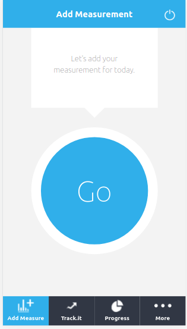
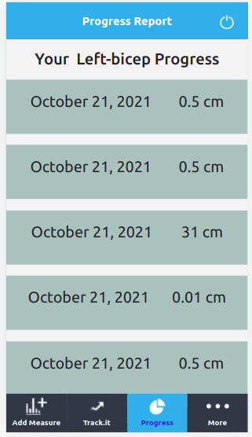

# Tracking App API

## Project Description

This is a web application designed to track measurements of body parts(Biceps, Thighs, Hip, and Waist) from an API, built with Rails. . It fetches data such as measurements from the back-end API and equally allows users to post new measurements data.
Here is the front-end repository ([API Repo](https://github.com/FrederickMih/Tracking-App-Front-end))

## Screenshots

 

### Built with

- Ruby
- Rails
- PostgresSQL
- shoulda-matchers
- Rspec

## Live Demo

[Try it out here](https://guarded-sands-43543.herokuapp.com/)

## Set up this project locally

- Open the terminal in the folder where you want to install the app;
- Run `https://github.com/FrederickMih/Tracking-app-api` to clone the project;
- Switch to the main directory of project using cd;
- Run `bundle install` in your terminal to install all dependencies.
- Run `rails server` to open up a live server
- Append one of the endpoints to http://localhost:3000/ in order to get/post data

## Setup database with:

- `rails db:setup`
- `rails db:migrate`

## API endpoints

- To get all available measurements `/measurements`
- To get data for one particular measurement `/measurements/1`
- To post new measurement data `/measurements/`

👤 **Mih Frederick**

## 🤝 Contributing

Contributions, issues, and feature requests are welcome!

If you want to contribute, you can clone this project or fork it.

If you found an issue, feel free to check the [issues page](https://github.com/FrederickMih/Tracking-App-Front-end/issues).

## Show your support

Give a ⭐️ if you like this project!

## Acknowledgments

- [Microverse](https://www.microverse.org/)

## License

MIT License
